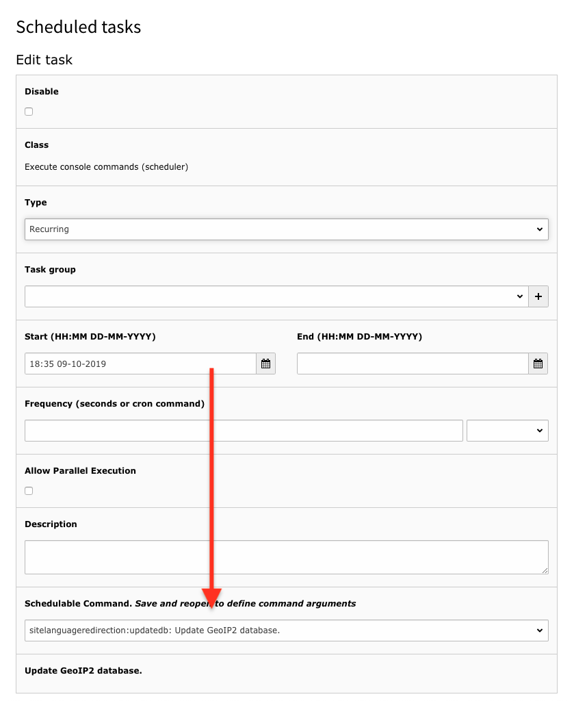
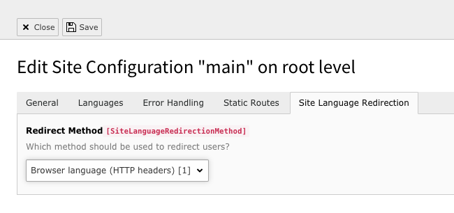

# TYPO3 Site Language Redirection

PSR-15 middleware to redirect user to correct site language.

- Language detection is based on HTTP headers (browser language) or IP address.
- When the user switches the language, a cookie gets set to save the new language as preferred language.

## Installation

Install via Extension Manager or composer.  

`composer require urbantrout/site-language-redirection`

### Enable IP address based redirects

1. Update the GeoIP2 database file for IP address based redirects via CLI or Scheduler.
    * **CLI**  
    `./vendor/bin/typo3 sitelanguageredirection:updatedb`
    * **Scheduler**  
    Create new task of class **Excute console commands** and set **Schedulable Command** to **sitelanguageredirection:updatedb**  
      
    Use this option to periodically update your database file.
2. Update the preferred method in your site configuration in the tab **Site Language Redirection**. Defaults to HTTP headers.  
  
Changing this value to **IP address** updates `config/sites/<sitename>/config.yaml` and adds the following line of code:  
```yaml
SiteLanguageRedirectionMethod: 2
```
